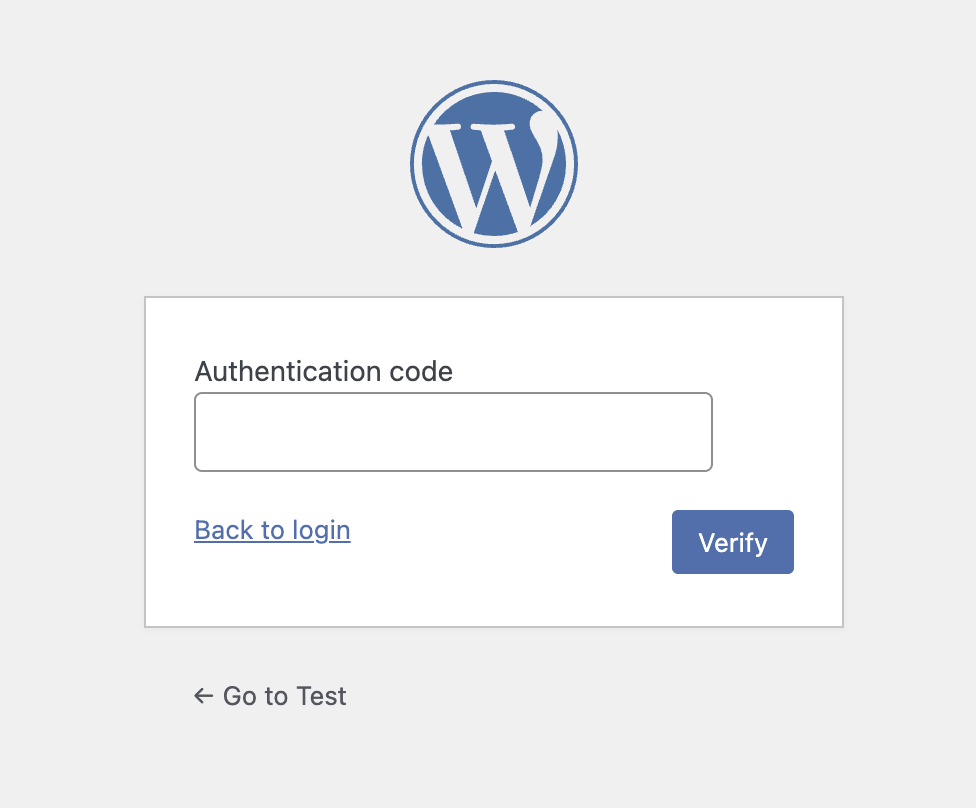

# AuthForge Login Security

AuthForge Login Security is a lightweight WordPress plugin that adds TOTP two-factor authentication (2FA) to login, with optional Cloudflare Turnstile.

## Features

- Two-step login flow:
  - Step 1: username/password (+ Turnstile if enabled)
  - Step 2: OTP or backup code (only for users who enabled 2FA)
- User-level 2FA setup modal with QR code and manual secret
- OTP verification required before enabling 2FA
- 9 one-time backup codes per generation
- Regenerate backup codes (old codes are invalidated immediately)
- Copy backup codes button
- Optional Cloudflare Turnstile on `wp-login.php`
- Turnstile live test popup in plugin settings
- Reconfigure warning (old authenticator secret/devices become invalid)
- Backup codes stored hashed

## Requirements

- WordPress 6.0+
- PHP 7.4+

## Installation

1. Upload `authforge-login-security` to `wp-content/plugins/`.
2. Activate **AuthForge Login Security** from **Plugins**.
3. (Optional) Go to **Settings -> AuthForge Login Security** and configure Turnstile.
4. Go to **Users -> Profile** and enable 2FA for your account.

## Login Behavior

- Users without 2FA enabled: login normally after Step 1.
- Users with 2FA enabled: redirected to Step 2 OTP screen.
- Step 2 accepts:
  - 6-digit authenticator OTP
  - one-time backup code

## Screenshots

### 2FA Setup Popup

### Turnstile On Login

## Security Notes

- Uses capability checks and nonces for setup/admin AJAX actions
- Temporary setup secret expires automatically
- Backup codes are hashed and consumed once

## External Services

Cloudflare Turnstile integration is optional.

- Service: Cloudflare Turnstile
- Purpose: anti-bot challenge on login and admin Turnstile test
- Data sent: challenge token and visitor IP address
- When sent: on login verification (if enabled) and on settings test action
- Terms: https://www.cloudflare.com/website-terms/
- Privacy: https://www.cloudflare.com/privacypolicy/

## License

GPL-2.0-or-later
